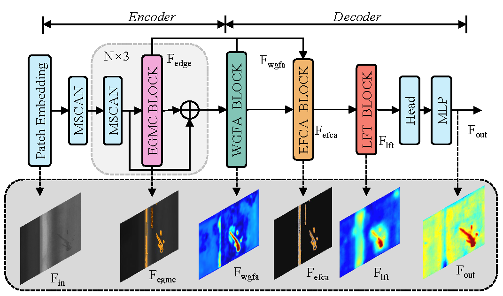
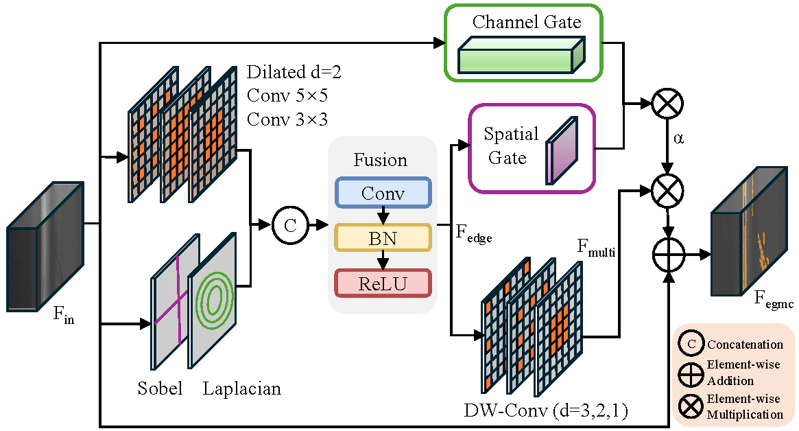
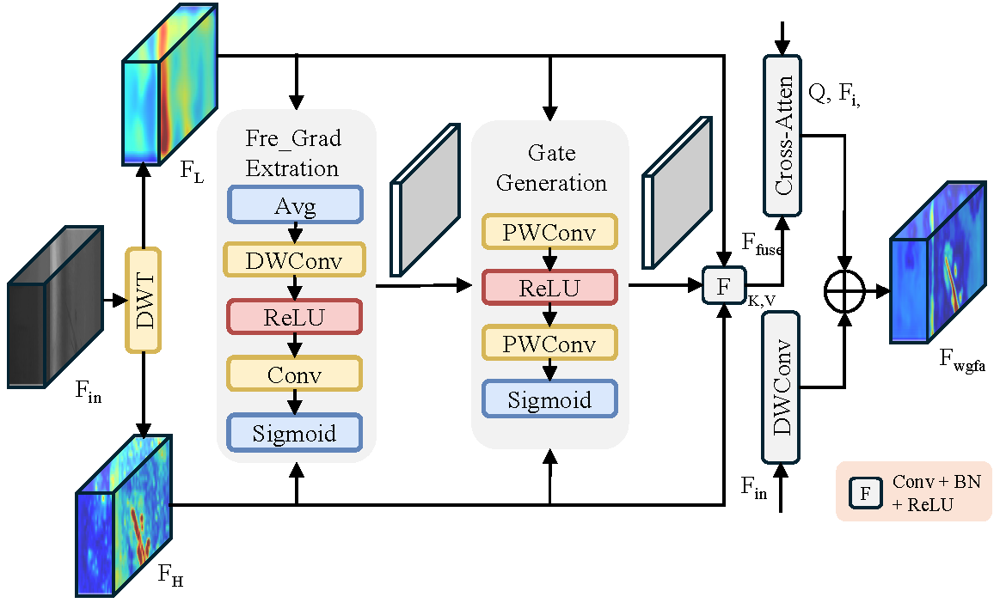
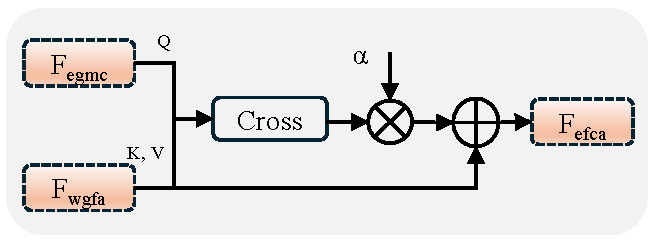
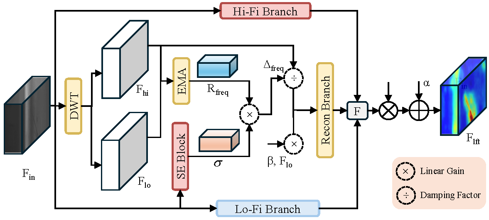

# EF-SyncNet: An Edge–Frequency Synchronized Multi-scale Network

---

## 📜 License & Acknowledgments

**Copyright (c) 2026. All rights reserved.**

This project is licensed under the **Apache License, Version 2.0**. You may obtain a copy of the License at [http://www.apache.org/licenses/LICENSE-2.0](http://www.apache.org/licenses/LICENSE-2.0).

This implementation is derived from or inspired by the following open-source projects:
- [OpenMMLab/mmsegmentation](https://github.com/open-mmlab/mmsegmentation)

We sincerely thank the authors for their contribution to the community. Please retain this attribution when redistributing or publishing works based on this project.

---

## 1. Model Architecture
The proposed EF-SyncNet leverages a collaborative synchronization of spatial-domain edge priors and frequency-domain features to achieve robust and fine-grained industrial defect segmentation.

*Fig1: Schematic diagram of the proposed EF-SyncNet architecture.

## 2. Core Modules

### 2.1 Edge-Guided Multi-Scale Context Module (EGMC)
This module incorporates gradient priors to capture spatial-domain edge information, effectively alleviating the over-smoothing effect caused by downsampling and preserving the structural integrity of defects.

*Fig2:Schematic diagram of the proposed EGMC architecture.

### 2.2 Wavelet-Guided Frequency Attention Module (WGFA)
This module performs frequency-domain decoupling via wavelet transform to refine defect texture features while suppressing noise interference in complex backgrounds.

*Fig3:Schematic diagram of the proposed WGFA architecture.

### 2.3 Edge-Frequency Cross-Attention Module (EFCA)
This module utilizes edge priors as spatial anchors to constrain frequency-domain features, ensuring that semantic information is focused within defect boundaries and preventing the dispersion of background semantics.

*Fig4:Schematic diagram of the proposed EFCA architecture.

### 2.4 Local Frequency Tuning Module (LFT)
This module adaptively calibrates feature representations to eliminate artifacts introduced by multi-scale interpolation in the decoder, further enhancing the local details of the segmentation masks.

*Fig5:Schematic diagram of the proposed LFT architecture.
